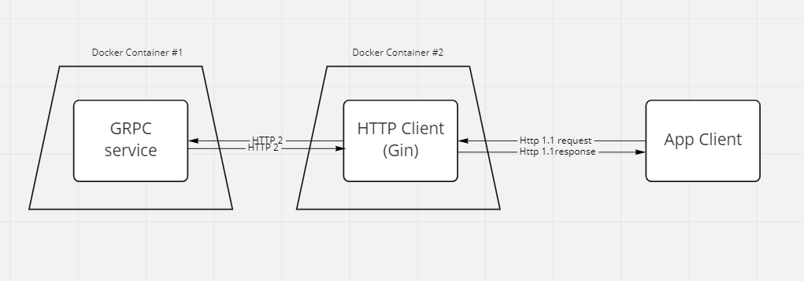

# docker-lesson

---
__Goals To learn :__

- __[GRPC](https://grpc.io)__ - A high performance, open source universal RPC framework

- __[Docker](https://docker.com/)__ -  is an open platform for developing, shipping, and running applications.

---

__Project Scheme:__

Documentation:
1) GRPC genereted code

`protoc --go_out=. --go_opt=paths=source_relative --go-grpc_out=. --go-grpc_opt=paths=source_relative proto/calculater.proto
`